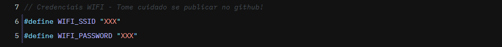
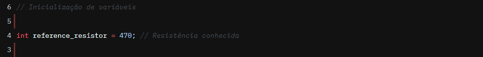
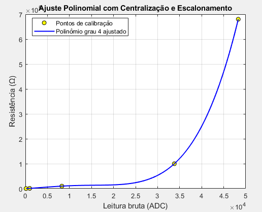
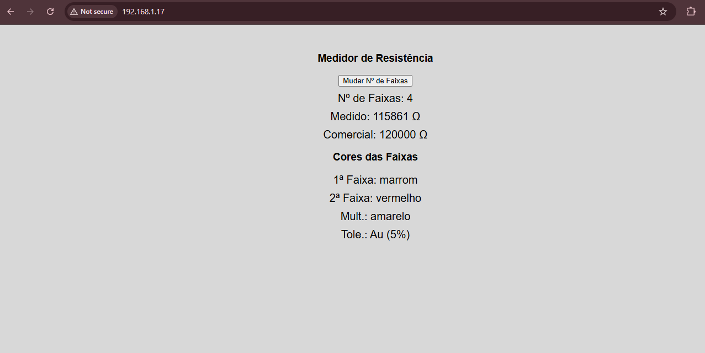

# Projeto WEBSERVER - PARTE 02 - EMBARCATECH
O objetivo desse projeto é implementar um servidor web com o Raspberry Pi Pico W utilizando a biblioteca lwIP. Este projeto implementa a leitura da do valor dos resistores a partir do conceito do divisor de tensão. Nesse projeto é utilizado um resistor de referência que é colocado em série com o resistor que deseja ser lido. Os dados da medida e do resistor comercial mais próximos são exibidos na página WEB hospedada no microcontrolador e que pode ser acessada por qualquer dispositivo que esteja conectado à mesma rede que o Raspberry Pi. Para conectar o dispositivo na sua rede local é necessário informar no arquivo main.c o SSID e a senha da rede Wi-Fi como é exibido na imagem abaixo.

Para realizar a leitura da resistência, deve ser conectado um resistor de valor conhecido em série com o resistor que quer ser medido da seguinte forma:
-  O jumper que é ligado no nó de encontro entre os dois resistores é conectado no GPIO 28;
- O jumper que é ligado na perna externa do resistor desconhecido é conectado no GND;
- O jumper que é ligado na perna externa do resistor conhecido é conectado no 3.3V.
- O valor do resistor conhecido deve ser informado no arquivo main.c como na imagem abaixo.

Para acessar a página WEB é necessário saber o endereço IP do Raspberry Pi. Para isso, abra o terminal serial e carregue o arquivo .uf2 para o seu dispositivo. Ao fazer isso, durante a inicialização será exibido no terminal o endereço IP. Escreva o endereço em qualquer navegador e você conseguirá acessar a página. Lembre-se de verificar se está conectado na mesma rede que o Raspberry.

## Calibração para a Medição (Interpolação polinomial)
Como queremos abranger medições de 100 ohms até 100k ohms, faremos medições para vários resistores ao longo da faixa especificada. Nesse caso, fizemos 5 medições. Em cada medição foi anotado um par de valores: o valor medido pelo adc e o valor real do resistor. A partir desses valores e, por meio da utilzação do MatLab, foi traçada uma curva que passasse pelos pontos obtidos e dessa curva, foram extraídos os coeficientes da equação que a descrevia. Em seguida, em posse desses coeficientes, foi declarado um array com esse valores e na hora de realizar a medição dos resistores, ao invés de retornar o valor médio medido, é feita uma comparação do valor obtido com a curva de calibração, por meio da utilização da função `calibration_poly` e, por fim, é feita a correção do valor medido.
Abaixo se Encontra os valores medidos.
- (valor médio, valor real)
- (150, 150)
- (974, 1000)
- (8277, 10000)
- (33800, 100000)
- (48300, 680000)
Após isso, como foi dito, utilizei o MatLab para obter os coeficientes do polinômia de quinto grau que melhor se ajusta os pontos obtidos. Abaixo é exibida uma imagem da curva obtida e dos pontos medidos.

Após isso os coeficientes são adicionados ao código e é criada uma função (função de horner) que é responsável por comparar o valor medido pelo ADC (valor médio de resistência) com a curva. Após essa comparação é feita o ajuste, e esse valor novo é retornado.

## Mudança Entre Número de Faixas
Nesse projeto, é possível realizar a mudança do tipo de resistor que está sendo medido, seja ele com 4 bandas (sério e24) ou com 5 bandas (série e96). Isso pode ser feito por meio da interface WEB, clicando no botão que aparece na tela. Ao fazer isso, os dados exibidos tanto no display quanto na página WEB serão correspondentes ao tipo de resistor selecionado, através das seguintes informações:
- Valor medido em tempo real;
- Valor comercial mais próximo;
- Cor de cada uma das faixas que compõe o resistor.

## Conexão Feita Para Realizar Leitura
Abaixo segue uma imagem que mostra a conexão feita para realizar a leitura da resistência do resistor desconhecido.
